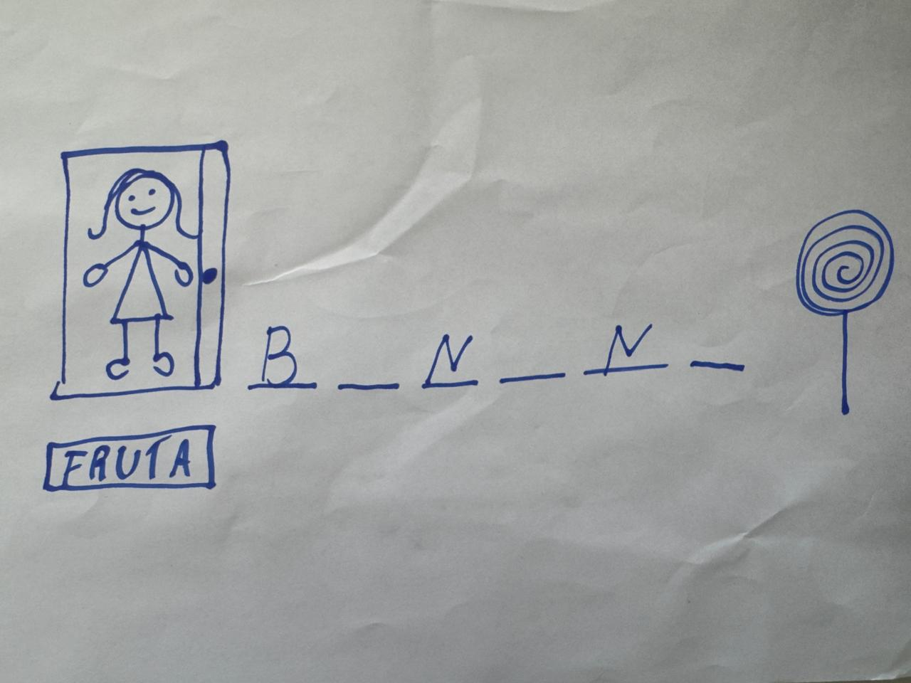

# Porta ou Pirulito



## Jogo de alfabeto e advinhar palavras, baseado no Jogo da Forca

- O objetivo do jogo é que a criança possa tentar adivinhar palavras, frutas e animais
- No lugar de uma Forca, temos uma menina atrás de uma porta aberta, do outro lado tem um pirulito
- Cada erro, a porta se fecha um pouco
- Se acertar, então a menina conseguiu atravessar a porta e pegar o pirulito

## 🚀 Tecnologias

- **Next.js 14** - Framework React
- **TypeScript** - Tipagem estática
- **TailwindCSS** - Estilização
- **Shadcn/UI** - Componentes de UI
- **Radix UI** - Componentes acessíveis

## 📦 Instalação

1. Instale as dependências:

```bash
npm install
```

ou

```bash
yarn install
```

ou

```bash
pnpm install
```

## 🎮 Como Executar

### Desenvolvimento

```bash
npm run dev
```

O jogo estará disponível em [http://localhost:3000](http://localhost:3000)

### Build para Produção

```bash
npm run build
npm start
```

## 📁 Estrutura do Projeto

```
/app
  /game
    page.tsx              # Página principal do jogo
    /components
      Door.tsx            # Componente da porta
      Girl.tsx            # Componente da menina
      Lollipop.tsx        # Componente do pirulito
      WordDisplay.tsx     # Exibição da palavra
      Keyboard.tsx        # Teclado virtual
      ProgressBar.tsx     # Barra de progresso
      ModalWin.tsx        # Modal de vitória
      ModalLose.tsx       # Modal de derrota
/lib
  game-constants.ts       # Listas de palavras e funções auxiliares
/components/ui           # Componentes Shadcn/UI
```

## 🎯 Como Jogar

1. O jogo seleciona aleatoriamente uma palavra (fruta ou animal)
2. Use o teclado virtual para adivinhar as letras
3. Cada erro faz a porta se fechar um pouco
4. Se você acertar todas as letras, a menina atravessa a porta e pega o pirulito! 🎉
5. Se a porta se fechar completamente, você perde 😢

## 🌐 Deploy

O projeto está configurado para deploy na Vercel. Basta fazer push para o repositório e conectar na Vercel.

## 📝 Licença

Este projeto é um jogo educativo desenvolvido para crianças.
